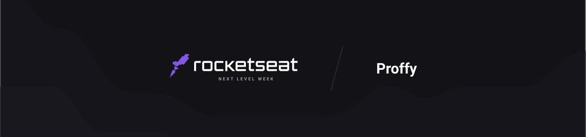

<p align="center">
  
  
  
</p>

## **:book: Summary**

- [About this project](#rocket-about-the-project)
- [Prerequisites](#warning-prerequisites)


## **:rocket: About the project**

This project was created by @tiagoluchtenberg (on Instagram) and developed in the  <a href="https://nextlevelweek.com/">Rocketseat NLW</a>#2 (accessible just a few weeks before the event) to honor the Internacional Education Professions Day (given in 06th August) through an interface focused and manage education relashionship between professors and pupils.

## **:warning: Prerequisites**

- <a href="https://nodejs.org/en/" target="_blank">NodeJS</a>
- <a href="https://yarnpkg.com/" target="_blank">YarnPKG</a> or <a href="https://www.npmjs.com/" target="_blank">NPM</a>
- <a href="" target="_blank">Android</a> or <a href="" target="_blank">iOS</a> Emulator


### Running the server

```bash
  # Clonning the repository
  git clone https://github.com/dgbragas/gostack__managing-repositories

  # Entering in the folder
  cd gostack__managing-repositories/backend

  # Installing project dependencies (you can also use 'npm install')
  yarn

  # Running the application (it will run at http://localhost:3000)
  yarn dev
```


### Running the web application
```bash
  # Open another terminal in root folder (gostack__managing-repositories) and and DON'T stop the backend
  # Enter in the front-end folder
  cd gostack__managing-repositories/frontend
  
  # Installing project dependencies (you can also use 'npm install')
  yarn

  # Running the application (it will run at http://localhost:3000)
  yarn start
```

### Running the web application
```bash
  # Clonning the repository
  git clone https://github.com/dgbragas/gostack__github-explorer

  # Entering in the cloned folder
  cd gostack__github-explorer/backend

  # Installing project dependencies (you can also use 'npm install')
  yarn

  # After initialize your AVD type: (the 'run-android' can be changed by 'run-ios' if in Mac environment):
  yarn react-native run-android

  # Then maybe you will need start the app again. For this you can type
  yarn start
```

---

Developed by @dgbragas
